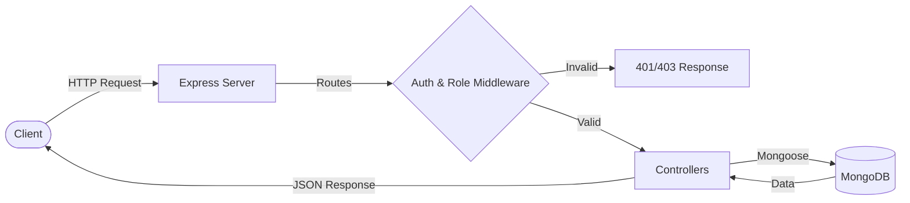

# ZORVYN


ZORVYN is a Node.js and Express-based backend application for managing financial transactions. It features a robust Role-Based Access Control (RBAC) system, allowing different levels of access for `viewer`, `analyst`, and `admin` roles. The application provides RESTful APIs for user management, transaction tracking, and dashboard summaries.

## Table of Contents
- [Features](#features)
- [Tech Stack](#tech-stack)
- [Architecture Diagram](#architecture-diagram)
- [Workflow](#workflow)
- [File and Folder Structure](#file-and-folder-structure)
- [Setup Process](#setup-process)
- [Testing with Postman or Client](#testing-with-postman-or-client)
- [Standard Response Formats](#standard-response-formats)
- [API Explanation & Examples](#api-explanation--examples)
- [Assumptions Made](#assumptions-made)
- [Tradeoffs Considered](#tradeoffs-considered)
- [Future Improvements](#future-improvements)

## Features

- **Authentication & Authorization**: Secure user registration and login using JWT stored in HTTP-only cookies.
- **Role-Based Access Control (RBAC)**:
  - **Viewer**: Can view overall dashboard summaries.
  - **Analyst**: Can view all transactions and user-specific dashboard summaries.
  - **Admin**: Full access to manage users (CRUD, role changes) and transactions (CRUD).
- **User Management**: Admins can create, read, update, delete users, and change their roles.
- **Transaction Management**: Track income and expenses with categories.
- **Dashboard**: Get aggregated financial summaries.

## Tech Stack

- **Runtime**: Node.js
- **Framework**: Express.js
- **Database**: MongoDB (via Mongoose)
- **Authentication**: JSON Web Tokens (JWT) & bcryptjs for password hashing
- **Environment Management**: dotenv

## Architecture Diagram



## Workflow

1. **Authentication**: A user registers or logs in via the `/api/auth` endpoints. Upon successful login, the server issues a JWT and sets it as an HTTP-only cookie in the user's browser.
2. **Request Interception**: For protected routes (e.g., `/api/transactions`), the request first hits the `auth.middleware`.
3. **Token Verification**: The `auth.middleware` extracts the JWT from the cookie and verifies it. If valid, it attaches the decoded user payload to the `req` object.
4. **Role Authorization**: The request then passes to the `role.middleware` (if applicable), which checks if the user's role (e.g., `admin`, `analyst`) is authorized to access the endpoint.
5. **Business Logic**: Once authorized, the request reaches the specific controller (e.g., `transaction.controller.js`). The controller performs the necessary business logic and interacts with the database using Mongoose models.
6. **Response**: The controller formats the data and sends a JSON response back to the client.

## File and Folder Structure

```text
ZORVYN/
├── server.js                 # Entry point of the application
├── package.json              # Project dependencies and scripts
├── .env.example              # Example environment variables
├── README.md                 # Project documentation
└── src/
    ├── app.js                # Express app setup and route registration
    ├── db/
    │   └── db.js             # MongoDB connection setup
    ├── controllers/          # Request handlers
    │   ├── auth.controller.js
    │   ├── dashboard.controller.js
    │   ├── transaction.controller.js
    │   └── user.controller.js
    ├── middlewares/          # Custom middlewares (Auth, RBAC)
    │   ├── auth.middleware.js
    │   └── role.middleware.js
    ├── models/               # Mongoose schemas and models
    │   ├── transaction.model.js
    │   └── user.model.js
    └── routes/               # API route definitions
        ├── auth.routes.js
        ├── dashboard.routes.js
        ├── transaction.router.js
        └── user.routes.js
```

## Setup Process

### Prerequisites

- Node.js (v18 or higher recommended)
- MongoDB instance (local or Atlas)

### Installation

1. **Clone the repository** (if not already done):
   ```bash
   git clone https://github.com/shubhamsamA/ZORVYN.git
   cd ZORVYN
   ```

2. **Install dependencies**:
   ```bash
   npm install
   ```

3. **Environment Variables**:
   Create a `.env` file in the root directory and configure the following variables:
   ```env
   PORT=3000
   MONGO_URI=your_mongodb_connection_string
   JWT_SECRET=your_jwt_secret_key
   ```

4. **Start the server**:
   ```bash
   node server.js
   ```

5. **Seed an Admin User (Optional but recommended for testing)**:
   To quickly test admin-only routes, run the seed script to create a default admin account.
   ```bash
   npm run seed
   ```
   *Credentials created:*
   - **Email**: `admin@zorvyn.com`
   - **Password**: `admin123`

The server will start running on `http://localhost:3000` (or the port specified in your `.env`).

## Testing with Postman or Client

> 💡 **Pro Tip**: We have included a pre-configured Postman collection to make testing easier! 
> 1. Open Postman.
> 2. Click **Import** and select the `ZORVYN_Postman_Collection.json` file from the root of this repository.
> 3. The collection includes all routes, pre-filled JSON bodies, and variables for `baseUrl`, `userId`, and `transactionId`.

Before testing the APIs manually, keep these general rules in mind:
1. **Base URL**: Assume all endpoints are prefixed with `http://localhost:3000` (or your configured port).
2. **Headers**: For requests with a JSON body (`POST`, `PUT`, `PATCH`), always set the header:
   - `Content-Type: application/json`
3. **Authentication (Cookies)**: 
   - **Postman**: When you hit the `/api/auth/login` endpoint, Postman automatically saves the `token` cookie. Subsequent requests will automatically include this cookie.
   - **Client (Axios/Fetch)**: Ensure you set `withCredentials: true` (Axios) or `credentials: 'include'` (Fetch) so the browser sends the HTTP-only cookie with every request.

---

## Standard Response Formats

To help client-side developers integrate smoothly, ZORVYN follows a predictable response structure.

**Success Response (Single Object)**:
```json
{
  "message": "Operation successful message",
  "user": {
    "id": "...",
    "username": "...",
    "email": "...",
    "role": "..."
  }
}
```

**Success Response (List/Array)**:
Endpoints returning multiple items (like `GET /api/users`) return a direct JSON array:
```json
[
  { "id": "...", "username": "..." },
  { "id": "...", "username": "..." }
]
```

**Error Response**:
```json
{
  "message": "Description of the error (e.g., Invalid credentials, Unauthorized)"
}
```

---

## API Explanation & Examples

### Authentication (`/api/auth`)

#### 1. Register a new user
- **Endpoint**: `POST /api/auth/register`
- **Role**: Public (Default assigned role is `viewer`)
- **Postman/Client Body (JSON)**:
  ```json
  {
    "username": "johndoe",
    "email": "john@example.com",
    "password": "securepassword123"
  }
  ```

#### 2. Login
- **Endpoint**: `POST /api/auth/login`
- **Role**: Public
- **Description**: Authenticates the user and sets an HTTP-only JWT cookie.
- **Postman/Client Body (JSON)**:
  ```json
  {
    "email": "john@example.com",
    "password": "securepassword123"
  }
  ```

### Users (`/api/users`) - *Admin Only*

#### 1. Create a new user
- **Endpoint**: `POST /api/users`
- **Postman/Client Body (JSON)**:
  ```json
  {
    "username": "janedoe",
    "email": "jane@example.com",
    "password": "password123",
    "role": "analyst"
  }
  ```

#### 2. Retrieve all users
- **Endpoint**: `GET /api/users`
- **Usage**: Send a simple `GET` request. Ensure your admin cookie is attached.

#### 3. Update user details
- **Endpoint**: `PUT /api/users/:id`
- **Example URL**: `http://localhost:3000/api/users/65abc123def4567890abcdef`
- **Postman/Client Body (JSON)**:
  ```json
  {
    "username": "janedoe_updated",
    "isActive": false
  }
  ```

#### 4. Delete a user
- **Endpoint**: `DELETE /api/users/:id`
- **Example URL**: `http://localhost:3000/api/users/65abc123def4567890abcdef`

#### 5. Change a user's role
- **Endpoint**: `PATCH /api/users/:id/role`
- **Example URL**: `http://localhost:3000/api/users/65abc123def4567890abcdef/role`
- **Postman/Client Body (JSON)**:
  ```json
  {
    "role": "admin"
  }
  ```

### Transactions (`/api/transactions`)

#### 1. Create a new transaction
- **Endpoint**: `POST /api/transactions`
- **Role**: Admin only
- **Postman/Client Body (JSON)**:
  ```json
  {
    "userId": "65abc123def4567890abcdef",
    "amount": 150.50,
    "type": "expense",
    "category": "food",
    "notes": "Grocery shopping at local market"
  }
  ```

#### 2. Retrieve all transactions
- **Endpoint**: `GET /api/transactions`
- **Role**: Admin, Analyst
- **Usage**: Send a `GET` request. You can append query parameters to the URL to filter results.
- **Postman/Client Example URL with Queries**: 
  `http://localhost:3000/api/transactions?type=expense&category=food&startDate=2026-01-01&endDate=2026-12-31&page=1&limit=10`
- **Available Query Parameters**:
  - `type`: `income` or `expense`
  - `category`: e.g., `food`, `salary`, `rent`
  - `startDate` / `endDate`: `YYYY-MM-DD` format
  - `page` / `limit`: For pagination (e.g., `page=1&limit=10`)
  - `userId`: Filter by specific user ID (Admin only)

#### 3. Update a transaction
- **Endpoint**: `PUT /api/transactions/:id`
- **Role**: Admin only
- **Example URL**: `http://localhost:3000/api/transactions/65def456abc1234567fedcba`
- **Postman/Client Body (JSON)**:
  ```json
  {
    "amount": 200.00,
    "notes": "Updated grocery amount"
  }
  ```

#### 4. Delete a transaction
- **Endpoint**: `DELETE /api/transactions/:id`
- **Role**: Admin only
- **Example URL**: `http://localhost:3000/api/transactions/65def456abc1234567fedcba`

#### 5. Retrieve transactions for current user
- **Endpoint**: `GET /api/transactions/me`
- **Role**: Admin, Analyst
- **Usage**: Automatically uses the authenticated user's ID from the JWT cookie.

### Dashboard (`/api/dashboard`)

#### 1. Get overall financial summary
- **Endpoint**: `GET /api/dashboard/summary`
- **Role**: Admin, Analyst, Viewer
- **Usage**: Send a simple `GET` request.

#### 2. Get financial summary for a specific user
- **Endpoint**: `GET /api/dashboard/user/:userId`
- **Role**: Admin, Analyst
- **Example URL**: `http://localhost:3000/api/dashboard/user/65abc123def4567890abcdef`

## Assumptions Made

1. **Cookie-Based Authentication**: The application assumes that clients can handle and send cookies, as the JWT token is extracted from `req.cookies.token`.
2. **Default Role**: New users registered via the `/api/auth/register` endpoint are automatically assigned the `viewer` role. An `admin` must manually elevate their privileges if needed.
3. **Database Structure**: It is assumed that MongoDB is used and the connection string provided in `MONGO_URI` is valid and accessible.
4. **Transaction Categories**: Transactions are strictly categorized into predefined enums (`salary`, `freelance`, `food`, `rent`, `shopping`, `travel`, `health`, `education`, `other`).

## Tradeoffs Considered

1. **Cookie vs. Bearer Token**: The application uses cookies for JWT storage. 
   - *Tradeoff*: This provides better security against XSS attacks compared to storing tokens in `localStorage`, but it requires proper CORS and CSRF configuration if the frontend is hosted on a different domain.
2. **Role Management**: Roles are hardcoded as an enum (`viewer`, `analyst`, `admin`) in the User model.
   - *Tradeoff*: This makes the RBAC implementation simple and fast but less flexible. Adding new roles or granular permissions would require modifying the schema and middleware code rather than just updating a database table.
3. **Admin-Centric Transaction Creation**: Currently, only admins can create transactions. 
   - *Tradeoff*: This ensures strict control over financial records but might be a bottleneck if the system is intended for users to log their own expenses.

## Future Improvements

To further enhance the system design and production readiness, the following improvements are recommended:
- **Security Enhancements**: Integrate `helmet` for setting secure HTTP headers and `express-rate-limit` to prevent brute-force attacks on the `/api/auth` routes.
- **Input Validation**: Add a validation layer (e.g., `Joi` or `express-validator`) to sanitize and strictly validate incoming request payloads before they reach the controllers.
- **Centralized Error Handling**: Implement a global error-handling middleware to catch unhandled promise rejections and standardize all error responses.
- **Pagination Metadata**: Enhance array responses to include pagination metadata (e.g., `totalItems`, `totalPages`, `currentPage`) alongside the data array.
